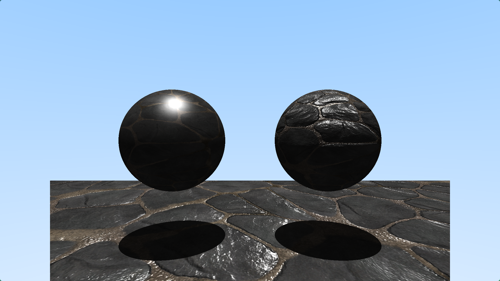
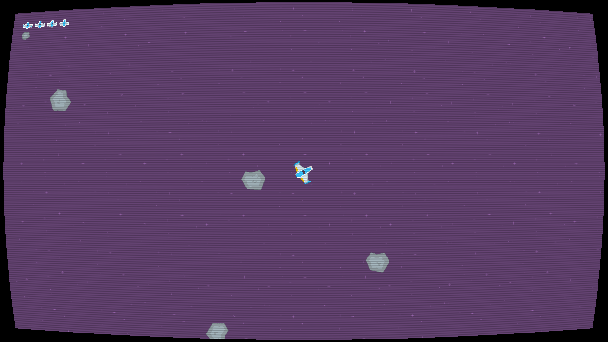

# Software Developer Portfolio

## About Me

I'm a software developer with a background as a freelance musician, a career where taking initiative and bringing your best each day was crucial. I'm enthusiastic about graphics programming and modern C++, but also enjoy diving deep into the inner workings of Linux/BSD operating systems.

## Links

- [Linkedin](https://www.linkedin.com/in/ville-kuusela-610859395)
- [Github](https://github.com/v-kuu)
- [Shadertoy](https://www.shadertoy.com/user/v_kuu)
- [Download my CV](assets/cv.pdf)

## Showcase

### [Raytracer](https://github.com/v-kuu/Raytracer)

I'm developing a raytracer for personal use as my big forever project. It has so far taught me a lot about project planning, build systems, modern C++, breaking circular dependencies, OOP patterns and most importantly how to implement algorithms related to graphics programming. My biggest use case for it is to continue learning and to have visual comparisons available for my implementations.

### [Asteroidgame](https://github.com/v-kuu/AsteroidGame)

I wanted to learn to use the SFML library for an upcoming Supercell internship challenge, so I made a little Asteroids inspired game using the library. I learned how to better handle user input and how to implement my own shaders into a real program.

### [Shaders](https://www.shadertoy.com/view/3fKcRD)
<video width="720" controls autoplay loop muted>
  <source src="assets/shadertoy.webm" type="video/webm">
  Your browser does not support the video tag.
</video>

I post all of my shaders publicly on my shadertoy profile to showcase my progress in GLSL and shader programming
